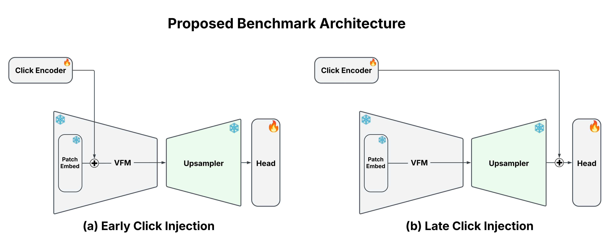

# iSegProbe: Probing VFMs and Feature Upsamplers using Interactive Segmentation  

<div style="text-align: center;">

</div>

## Introduction 
This repository provides the code for the technical report [[Arxiv]](https://arxiv.org/abs/2505.02075), and also serves as a standalone suite for probing and evaluating future methods in interactive segmentation (IS).

The `iSegProbe` repository includes:
- Pipelines for training and evaluating interactive segmentation models, specifically adapted for probing individual model components (`train.py`, `evaluate.py`)
- Implementations of vision backbones, such as ViT, MaskCLIP, and DINOv2, tailored for the interactive segmentation task (`core.model.featurizers`)
- Implementations of multiple feature upsamplers, including [LiFT](https://arxiv.org/abs/2403.14625v1), [FeatUp](https://arxiv.org/abs/2403.10516), and [LoftUp](https://arxiv.org/abs/2504.14032) (`core.model.upsamplers`) 
- Support for major IS datasets: GrabCut, DAVIS, SBD, Berkeley, COCO+LVIS ... (`core.data`)
- Visualization utilities for plotting predictions and features, as well as recreating plots from the report

## Contents
<!--ts-->
   * [Installation](#installation)
   * [Evaluation](#evaluation)
   * [Interactive Demo](#interactive-demo)
   * [Plotting Utilities ](#plotting-utilities)
   * [Citation](#citation)
   * [Acknowledgements](#acknowledgements)
<!--te-->
## Installation

### Environment
Developed and tested on Python 3.9, PyTorch 2.4.1, CUDA 12.4, Ubuntu 20.04. To install the required dependencies, run:
```bash
pip install -r requirements.txt
```
### Datasets
Download the dataset(s) relevant to your use case and and specify the corresponding paths in the `configs/main_cfg.yaml`.

> 📌 **Note:** Our experiments were conducted on SBD (train) and GrabCut, DAVIS, Berkeley and SBD (test). However, other datasets are fully supported and can be used with minimal effort.


| Dataset   |                      Description             |           Download Link              |
|-----------|----------------------------------------------|:------------------------------------:|
|ADE20k     |  22k images with 434k instances (total)      |  [official site][ADE20k]             |
|OpenImages |  944k images with 2.6M instances (total)     |  [official site][OpenImages]         |
|MS COCO    |  118k images with 1.2M instances (train)     |  [official site][MSCOCO]             |
|LVIS v1.0  |  100k images with 1.2M instances (total)     |  [official site][LVIS]               |
|COCO+LVIS* |  99k images with 1.5M instances (train)      |  [original LVIS images][LVIS] + <br> [combined annotations][COCOLVIS_annotation] |
|SBD        |  8498 images with 20172 instances for (train)<br>2857 images with 6671 instances for (test) |[official site][SBD]|
|Grab Cut   |  50 images with one object each (test)       |  [GrabCut.zip (11 MB)][GrabCut]      |
|Berkeley   |  96 images with 100 instances (test)         |  [Berkeley.zip (7 MB)][Berkeley]     |
|DAVIS      |  345 images with one object each (test)      |  [DAVIS.zip (43 MB)][DAVIS]          |
|Pascal VOC |  1449 images with 3417 instances (validation)|  [official site][PascalVOC]          |
|COCO_MVal  |  800 images with 800 instances (test)        |  [COCO_MVal.zip (127 MB)][COCO_MVal] |

[ADE20k]: http://sceneparsing.csail.mit.edu/
[OpenImages]: https://storage.googleapis.com/openimages/web/download.html
[MSCOCO]: https://cocodataset.org/#download
[LVIS]: https://www.lvisdataset.org/dataset
[SBD]: https://www2.eecs.berkeley.edu/Research/Projects/CS/vision/grouping/semantic_contours/benchmark.tgz
[GrabCut]: https://github.com/saic-vul/fbrs_interactive_segmentation/releases/download/v1.0/GrabCut.zip
[Berkeley]: https://github.com/saic-vul/fbrs_interactive_segmentation/releases/download/v1.0/Berkeley.zip
[DAVIS]: https://github.com/saic-vul/fbrs_interactive_segmentation/releases/download/v1.0/DAVIS.zip
[PascalVOC]: http://host.robots.ox.ac.uk/pascal/VOC/
[COCOLVIS_annotation]: https://github.com/saic-vul/ritm_interactive_segmentation/releases/download/v1.0/cocolvis_annotation.tar.gz
[COCO_MVal]: https://github.com/saic-vul/fbrs_interactive_segmentation/releases/download/v1.0/COCO_MVal.zip

(*) - To prepare **COCO+LVIS**, first download the original LVIS v1.0 dataset. Then, download and unpack the pre-processed annotations provided by the [RITM team](https://github.com/SamsungLabs/ritm_interactive_segmentation), which combine COCO and LVIS. Place the annotations in the same folder as LVIS v1.0.

> For an extended list of supported datasets, refer to the SimpleClick dataset collection:  [[link](https://github.com/uncbiag/SimpleClick/tree/71eee559fefdd22076e6a973792ba874a0cee762/isegm/data/datasets)] 
### Upsamplers 

Download upsampler weights and specify the corresponding paths in the `configs/main_cfg.yaml`:

- **LoftUp** (DINOv2 S/14): [[Google Drive Link]](https://drive.google.com/file/d/1Sse4gq2dCSNT-rnTVja7pG9ogIGfT0Ue/view?usp=drive_link)
- **LiFT** (DINOv2 S/14): [[Google Drive Link]]( https://drive.google.com/file/d/1h4yANgeCVV2du0L4dusK49JiX1_nH8ax/view?usp=drive_link)

> For additional trained upsamplers, refer to the LoftUp repository:  [[link](https://github.com/andrehuang/loftup)] 

## Evaluation

Evaluation of the vision foundation model (and feature upsampler) involves two separate stages: (1) training the interactive segmentation model, and (2) performing the actual evaluation.

### Train Your IS Model
General training configurations are specified in `configs/train_cfg.yaml`. For a detailed explanation of the parameters, please refer directly to that file. Each training experiment (containing IS model, datasets and other components) should be defined in a separate Python file, which is then referenced from `train_cfg.yaml`. Examples of such files can be found in the `models/` directory.

To launch the training process, you can either modify `train_cfg.yaml` accordingly and run:
```bash 
python train.py
```
Or override specific arguments directly with CLI using Hydra syntax, for example:
```python
python train.py +exp.name=my_name +exp.model_path=/path/to/my/model
```

### Evaluate Your IS Model
General evaluation configurations are specified in `configs/eval_cfg.yaml`. For a detailed explanation of the parameters, please refer directly to that file. 

To launch the evaluation process, you can either modify `eval_cfg.yaml` accordingly and run:
```bash 
python evaluate.py
```
Or override specific arguments directly with CLI using Hydra syntax, for example:
```python
python evaluate.py +checkpoint=/path/to/checkpoints +datasets=GrabCut,Berkeley,SBD,DAVIS
```

### Logging
- Training logs can be visualized using **TensorBoard** and **Weights & Biases**.
  #### TensorBoard
  To enable TensorBoard, locate folders with experiments output (could be also some root folder containing multiple runs) and run: 
  ```python
  tensorboard --logdir=PATH_TO_LOG_DIR --port=6006
  ```
  #### **Weights & Biases**
  To enable logging to W&B, set the `wandb.log_wandb=true` in `train_cfg.yaml`.

- Separate **Weights & Biases** evaluation logging is available by setting `wandb=true` in `eval_cfg.yaml`.

## Interactive Demo 

<div style="text-align: center;">
  
</div>

To launch Tkinter-based interactive demo, run: 
```bash
python demo.py --checkpoint /path/to/ckpts 
```

**Demo Controls**:

| Key                                                           | Description                        |
| ------------------------------------------------------------- | ---------------------------------- |
| <kbd>Left Mouse Button</kbd>                                  | Place a positive click             |
| <kbd>Right Mouse Button</kbd>                                 | Place a negative click             |
| <kbd>Scroll Wheel</kbd>                                       | Zoom an image in and out           |
| <kbd>Right Mouse Button</kbd> + <br> <kbd>Move Mouse</kbd>    | Move an image                      |
| <kbd>Space</kbd>                                              | Finish the current object mask     |

- Some test images can be found in the `assets/test_imgs` folder.
- For a more detailed description of the demo parameters and functionality, refer to the [RITM](https://github.com/SamsungLabs/ritm_interactive_segmentation/tree/master?tab=readme-ov-file#interactive-segmentation-demo) codebase.

### Additional Comments 
- When launching the demo from a remote machine, you may need to have **X11** (or **XQuartz**) installed and running on your local machine with proper X11 forwarding. 
- If the demo exits incorrectly, the process might not terminate properly, leading to the following error on the next launch:
```bash
free(): invalid pointer
```
To resolve this, kill the demo process by running:
```bash
pkill -9 -f demo.py 
```


## Plotting Utilities 
In the `eval_cfg.yaml` file, the `vis_preds` flag is responsible for visualizing the model's predictions, while the `save_feats` flag controls whether raw features before and after the upsampler are saved. These saved features can be further visualized using the script `core.plots.plot_features.py`. Additionally, the script `core.plots.plot_iou_vs_clicks.py` can be used to perform a comparison of the mean Intersection over Union (mIoU) as a function of the number of clicks made.

## Citation 
If you find this repository useful, please cite our papers:
```bibtex
@misc{huang2025loftuplearningcoordinatebasedfeature,
      title={LoftUp: Learning a Coordinate-Based Feature Upsampler for Vision Foundation Models}, 
      author={Haiwen Huang and Anpei Chen and Volodymyr Havrylov and Andreas Geiger and Dan Zhang},
      year={2025},
      eprint={2504.14032},
      archivePrefix={arXiv},
      primaryClass={cs.CV},
      url={https://arxiv.org/abs/2504.14032}, 
}

@misc{havrylov2025benchmarking,
    title={Benchmarking Feature Upsampling Methods for Vision Foundation Models using Interactive Segmentation},
    author={Volodymyr Havrylov and Haiwen Huang and Dan Zhang and Andreas Geiger},
    year={2025},
    eprint={2505.02075},
    archivePrefix={arXiv},
    primaryClass={cs.CV},
    url={https://arxiv.org/abs/2505.02075}, 
}
```

## Acknowledgements
This repository is based on [SimpleClick](https://github.com/uncbiag/SimpleClick) and [RITM](https://github.com/SamsungLabs/ritm_interactive_segmentation), with most of the featurizers code adapted from [FeatUp](https://github.com/mhamilton723/FeatUp). We thank the authors of these open-source projects for their valuable contributions.
